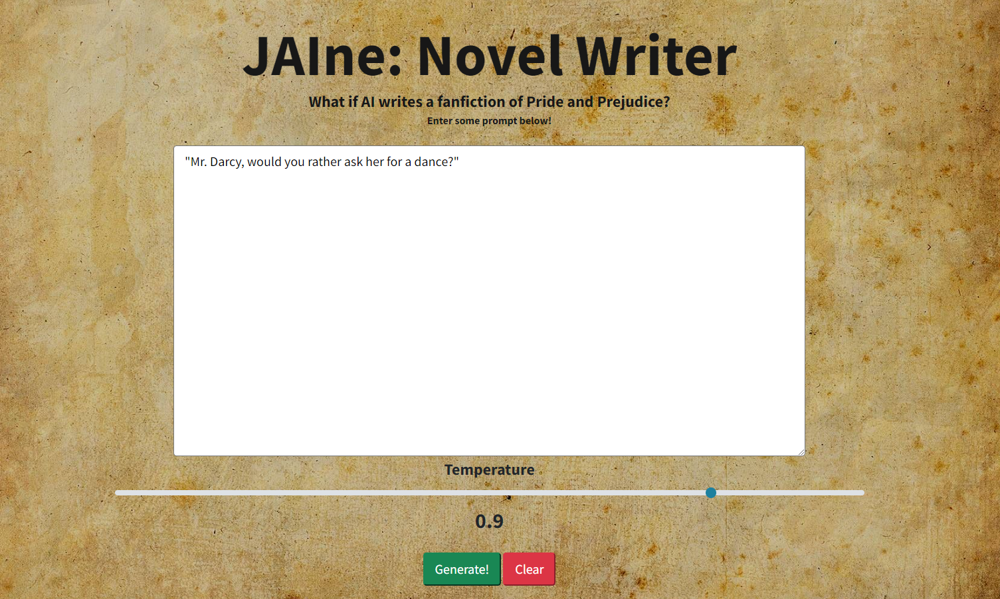

# JAIne: Novel Writer Bot
A text generation for Victorian English novel.



Given a prompt, the model will attempt to generate a brand new story in the fictional world of "Pride and Prejudice". The model is a pre-trained GPT-2 that is fine-tuned on the mentioned novel to recreate a writing style of Jane Austen. The model automatically generate the text with proper pucntuation and spacing - it learns how to add spaces between words, how to enquote character sayings in quotation marks properly, and also how to space between paragraphs for better flow of reading. The model will give an interesting story involving familiar characters from the novel, which will be helpful for fanfictions, ideas suggestion, and entertainment.


### Dataset
The datase used is the novel called "Pride and Prejudice" writen by Jane Austen in 1813. The book consists of 61 chapters written in well-formatted text which features numerous character conversations encapsulated in quotation marks and narrative description of the settings. The book is publicly available at The Gutenberg Foundation.

### Web Application
This repository builds a web app featuring a fine-tuned GPT-2 model for generation task. A user can simply input their prompt and see the magic happens!

Also, a user can change the temperature (craziness) of the output by adjusting a slider. Default is 0.9

### Running the application

First, make sure you installed these dependencies
- aitextgen
- pytorch
- Flask

Then, clone this repository
```
git clone https://github.com/sunnypwang/novel-writer.git
```
Download the model weights and config file here: https://drive.google.com/file/d/1w3u5mobIDdeX5j77C3CgEBdh94D7JewO/view

Then, Navigate to `app/model` and place those files.

Finally, run the web application using
```
python main.py
```

### Advanced Features

Advanced features of thr project could be recreating modern fictions in Victorian English era. For example, generating a movie plot script in Jane Austen's writing style. Another extension is 
to generate a set of chapters to be used as input on other tasks, such as Generative Adversarial Networks (GAN) training. Finally, we could deploy to web servers as a idea exploration for future novel writers to experiment with different stories humans might not come up with.

### Acknowledgement

This project is part of the NLP Crash Course for AI Camp Summer Internship 2022.
